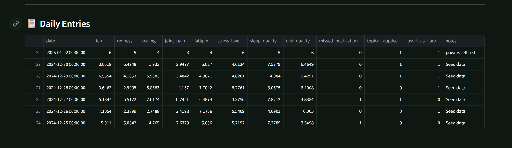
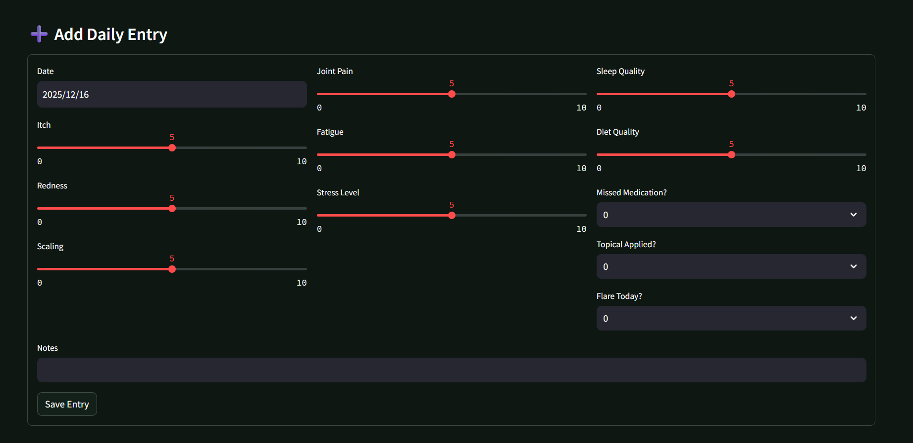
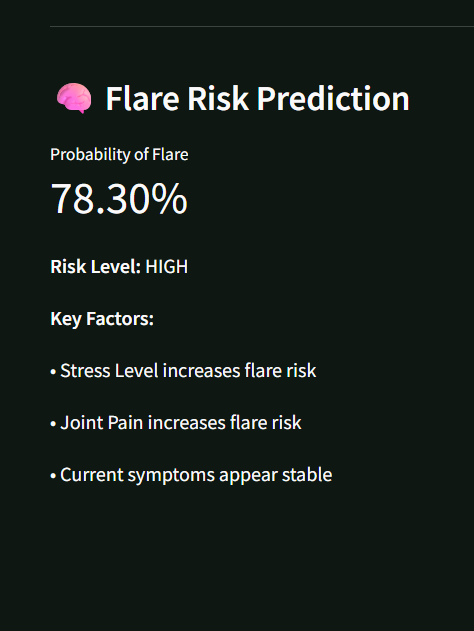

<div align="center">

# 🩺 Psoriasis Agent

### A Full-Stack, ML-Powered Health Tracking & Flare Prediction System

[](https://www.python.org/downloads/)
[](https://fastapi.tiangolo.com/)
[](https://streamlit.io/)
[](https://opensource.org/licenses/MIT)

**Psoriasis Agent** is a comprehensive health analytics application designed to help individuals with psoriasis and psoriatic arthritis track daily symptoms, analyze trends, and predict flare risks using machine learning.

[Features](#-features) • [Tech Stack](#-tech-stack) • [Setup](#-setup-instructions) • [Screenshots](#-screenshots) • [License](#-license)

</div>

---

## 🌟 Features

<table>
<tr>
<td width="50%">

### 📊 Health Tracking
- **Daily symptom logging** with 10+ health metrics
- **Weekly & monthly** health summaries
- **Interactive visualizations** with trend analysis
- **SQLite database** for local data storage

</td>
<td width="50%">

### 🤖 Machine Learning
- **Flare risk prediction** using Logistic Regression
- **Risk level classification** (LOW/MEDIUM/HIGH)
- **Key factor identification** for flare triggers
- **Color-coded risk bands** for visual analysis

</td>
</tr>
</table>

---

## 📸 Screenshots

<div align="center">

### Daily Symptom Tracking


*Track and view all your daily health entries in an organized table format*

<br><br>

### Add New Entry


*Intuitive form to log daily symptoms with interactive sliders*

<br><br>

### Flare Risk Prediction


*ML-powered prediction showing probability and key risk factors*

<br><br>

### Symptom Trend Analysis


*Visual trends with color-coded risk bands to identify patterns*

</div>

---

## 🛠️ Tech Stack

<table>
<tr>
<td valign="top" width="50%">

### Backend
```
🐍 Python
⚡ FastAPI
🗄️ SQLAlchemy
💾 SQLite
🤖 Scikit-Learn
📊 Pandas
```

</td>
<td valign="top" width="50%">

### Frontend
```
🎨 Streamlit
📈 Plotly
🌐 Requests
```

</td>
</tr>
</table>

---

## 📁 Project Structure

```
psoriasis-agent/
│
├── backend/
│   ├── app/
│   │   ├── routers/
│   │   │   ├── entries.py
│   │   │   └── ml.py
│   │   ├── crud.py
│   │   ├── database.py
│   │   ├── models.py
│   │   └── schemas.py
│   ├── ml_model.py
│   ├── seeddata.py
│   ├── main.py
│   └── requirements.txt
│
├── frontend/
│   └── app.py
│
├── screenshots/
│   ├── DailyEntries.png
│   ├── Entry.png
│   ├── FlareRiskPrediction.png
│   └── SymptomTrends.png
│
├── .gitignore
├── LICENSE
└── README.md
```

---

## 🚀 Setup Instructions

### 1️⃣ Clone the Repository

```bash
git clone https://github.com/ARYANBHAT-eng/psoriasis-agent.git
cd psoriasis-agent
```

### 2️⃣ Backend Setup

<details>
<summary><b>Click to expand backend setup</b></summary>

#### Create Virtual Environment (Recommended)
```bash
python -m venv venv

# Windows
venv\Scripts\activate

# Mac/Linux
source venv/bin/activate
```

#### Install Dependencies
```bash
cd backend
pip install -r requirements.txt
```

#### Start Backend Server
```bash
uvicorn main:app --reload
```

✅ **Backend URL:** `http://127.0.0.1:8000`  
📚 **API Docs:** `http://127.0.0.1:8000/docs`

</details>

### 3️⃣ Database Initialization

The SQLite database (`psoriasis.db`) is automatically created when the backend starts.

#### Optional: Seed Sample Data

```bash
python seeddata.py
```

**Expected output:** `✓ Seed data inserted successfully`

### 4️⃣ Train Machine Learning Model

Before predictions work, train the ML model:

**Option A: Using API**
```bash
POST http://127.0.0.1:8000/ml/train
```

**Option B: Using Swagger UI**
- Navigate to `http://127.0.0.1:8000/docs`
- Find `/ml/train` endpoint
- Click "Try it out" → "Execute"

**Successful Response:**
```json
{
  "status": "trained",
  "samples": 30
}
```

### 5️⃣ Frontend (Streamlit Dashboard)

```bash
cd frontend
streamlit run app.py
```

🎨 **Dashboard URL:** `http://localhost:8501`

---

## 📊 Dashboard Capabilities

| Feature | Description |
|---------|-------------|
| ➕ **Add Entries** | Log daily symptoms with interactive sliders |
| 📅 **View Toggle** | Switch between weekly and monthly views |
| 📈 **Health Summary** | View key health metrics at a glance |
| 🎨 **Trend Analysis** | Color-coded risk bands for symptom patterns |
| 🤖 **ML Prediction** | Get flare risk probability and key factors |
| 🔍 **Risk Factors** | Identify what's contributing to flare risk |

---

## 🤖 Machine Learning Overview

<table>
<tr>
<td width="33%">

### Model
**Logistic Regression**
- Binary classification
- Probabilistic output
- Interpretable results

</td>
<td width="33%">

### Features (10)
- Itch intensity
- Redness level
- Scaling severity
- Joint pain
- Fatigue level
- Stress level
- Sleep quality
- Diet quality
- Missed medication
- Topical applied

</td>
<td width="33%">

### Output
**Flare Prediction**
- Probability (0-100%)
- Risk Level:
  - 🟢 LOW
  - 🟡 MEDIUM
  - 🔴 HIGH
- Key contributing factors

</td>
</tr>
</table>

---

## 🗺️ Roadmap / Future Work

- [ ] 📱 Mobile application (React Native / Flutter)
- [ ] 🔐 User authentication & multi-user support
- [ ] ☁️ Cloud deployment (AWS/Azure/GCP)
- [ ] 🔑 API key integration
- [ ] 🧠 Advanced ML models (Random Forest, XGBoost)
- [ ] 📊 Long-term flare forecasting
- [ ] 📧 Email/SMS alerts for high-risk predictions
- [ ] 🌐 Multi-language support
- [ ] 📤 Export reports (PDF/CSV)
- [ ] 🔗 Integration with wearable devices

---

## 📝 License

This project is licensed under the **MIT License** - see the [LICENSE](LICENSE) file for details.

```
MIT License - Free to use, modify, and distribute.
```

---

## 👨‍💻 Author

<div align="center">

**Aryan Bhat**

[](https://github.com/ARYANBHAT-eng)

---

### ⭐ Star this repo if you find it helpful!

Made with ❤️ for the psoriasis community

</div>
