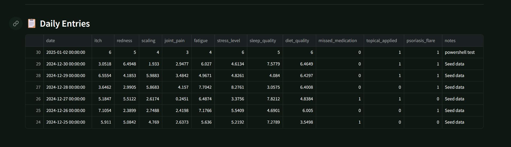
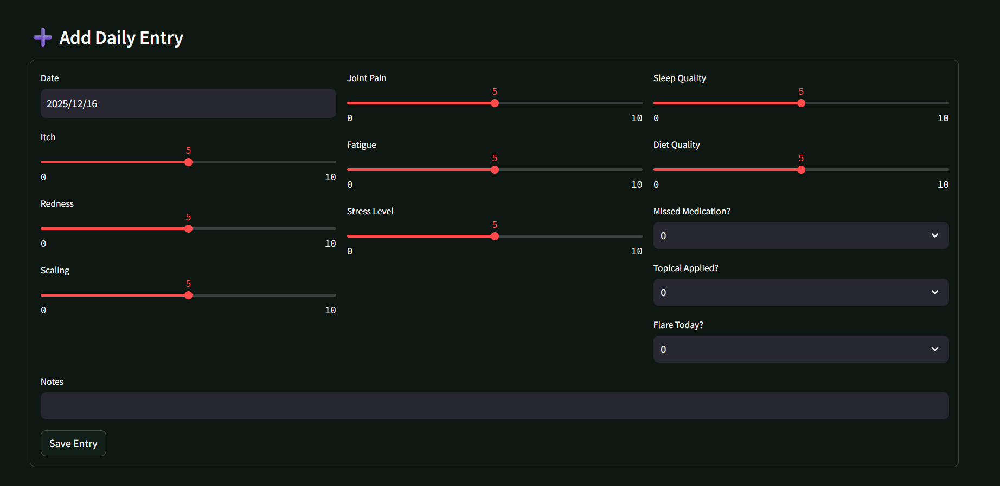
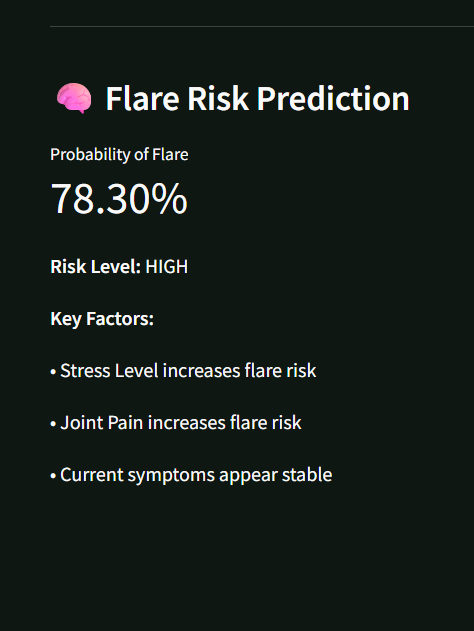
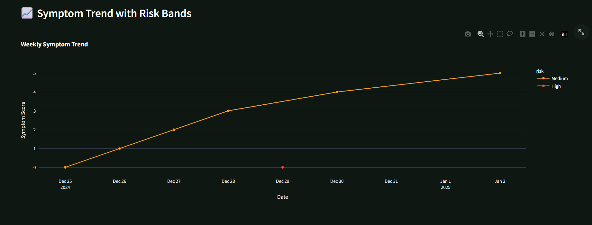

<div align="center">

# 🩺 Psoriasis Agent

### A Full-Stack, ML-Powered Health Tracking & Flare Prediction System

[](https://www.python.org/downloads/)
[](https://fastapi.tiangolo.com/)
[](https://streamlit.io/)
[](https://opensource.org/licenses/MIT)

**Psoriasis Agent** is a comprehensive health analytics application designed to help individuals with psoriasis and psoriatic arthritis track daily symptoms, analyze trends, and predict flare risks using machine learning.

[Features](#-features) • [Tech Stack](#-tech-stack) • [Setup](#-setup-instructions) • [Screenshots](#-screenshots) • [Future Scope](#-future-scope) • [License](#-license)

</div>

---

## 🌟 Features

<table>
<tr>
<td width="50%">

### 📊 Health Tracking
- **Daily symptom logging** with 10+ health metrics
- **Weekly & monthly** health summaries
- **Interactive visualizations** with trend analysis
- **PostgreSQL** (Render-managed) with Alembic migrations

</td>
<td width="50%">

### 🤖 Machine Learning
- **Flare risk prediction** using Logistic Regression
- **Risk level classification** (LOW/MEDIUM/HIGH)
- **Key factor identification** for flare triggers
- **Color-coded risk bands** for visual analysis

</td>
</tr>
</table>

---

## 📸 Screenshots

<div align="center">

### Daily Symptom Tracking


*Track and view all your daily health entries in an organized table format*

<br><br>

### Add New Entry


*Intuitive form to log daily symptoms with interactive sliders*

<br><br>

### Flare Risk Prediction


*ML-powered prediction showing probability and key risk factors*

<br><br>

### Symptom Trend Analysis


*Visual trends with color-coded risk bands to identify patterns*

</div>

---

## 🛠️ Tech Stack

<table>
<tr>
<td valign="top" width="50%">

### Backend
```
🐍 Python 3.11.9
⚡ FastAPI 0.111.0
🗄️ SQLAlchemy 2.0 + PostgreSQL
🔄 Alembic (migrations)
⚙️ pydantic-settings
🔐 python-jose (JWT / HS256)
🔑 passlib[bcrypt]
🤖 Scikit-Learn
📊 Pandas
🧪 pytest + httpx
🌤️ Open-Meteo (weather, no API key)
```

</td>
<td valign="top" width="50%">

### Frontend
```
🎨 Streamlit
📈 Plotly
🌐 Requests
```

</td>
</tr>
</table>

---

## 🗃️ Data Model

Six tables underpin the application. All user-created rows are scoped to a single user and included in the data export and account deletion.

| Table | Purpose | Key fields |
|---|---|---|
| `entries` | Daily symptom + lifestyle log, one row per day per user | itch, redness, scaling, joint_pain, fatigue, stress_level, sleep_quality, diet_quality, missed_medication, topical_applied, bsa_estimate, plaque_locations (Psoriasis); morning_stiffness_minutes, affected_joints, functional_limitation (PsA); alcohol_units, illness_active, illness_description, cycle_day_of_period (triggers) |
| `user_profiles` | 1:1 with users; gates condition-specific fields in the UI and API | has_psoriasis, has_psa, tracks_cycle, location_city, location_lat/lon (2dp precision), timezone |
| `weather_captures` | Auto-fetched daily via Open-Meteo when a location is set; one row per user per day | temperature_c, humidity_pct, uv_index, precipitation_mm, cloud_cover_pct, pressure_hpa |
| `medication_events` | Append-only treatment change log (start/stop/dose changes); separate from daily missed_medication flag | date, medication_name, event_type, dose, notes |
| `flare_events` | Structured flare tracking with open/close lifecycle; decoupled from daily entries | start_date, end_date (NULL = ongoing), condition_type (psoriasis/psa/both), severity (1–10), confidence_source (user_confirmed/algorithm_derived/legacy), notes |
| `model_artifacts` | ML model binary storage; survives redeploys | model_blob, trained_at, accuracy |

`entries` previously called `daily_entries` (renamed in Phase 1 migration `02f40192a44c`). The legacy `psoriasis_flare` column is preserved as `legacy_flare_flag` and backfilled into `flare_events` with `confidence_source='legacy'`.

---

## 🏥 Clinical Context

**Why psoriasis and psoriatic arthritis are tracked separately.** Psoriasis is a skin condition driven primarily by immune-mediated inflammation, with flares often correlating with stress, illness, and environmental triggers like humidity and UV exposure. Psoriatic arthritis involves joint inflammation with a different trigger profile — morning stiffness duration, affected joint pattern, and functional limitation are the clinically standard metrics (used in DAPSA scoring). The time-to-onset from trigger to visible flare differs between conditions, and a model conflating both produces statistically coincidental rather than predictive outputs. `UserProfile.has_psoriasis` and `has_psa` gate which fields are collected, validated, and eventually fed to separate Phase 2 models.

**Why flare events are separate from daily entries.** A daily log entry records "how I feel today." A flare event records "I had a flare, it lasted N days, I'm confident about it." Conflating these creates label noise: people tend to mark a flare only when symptoms are already severe, teaching the model to predict obvious flares rather than early-warning signals. Separating them allows confidence annotation (`confidence_source`), multi-day event representation, and clean lifecycle management (open flares vs. closed). Legacy `legacy_flare_flag` values from pre-Phase 1 data are preserved as low-confidence seed labels with `confidence_source='legacy'` until Phase 2 validates the new labeling pipeline.

---

## 📁 Project Structure

```
psoriasis-agent/
│
├── backend/
│   ├── alembic/
│   │   └── versions/              # 7 migration scripts (3 Phase 0 + 4 Phase 1)
│   ├── app/
│   │   ├── routers/
│   │   │   ├── auth.py
│   │   │   ├── entries.py         # v1 + v2 entry routes
│   │   │   ├── flares.py          # /v2/flares CRUD
│   │   │   ├── medications.py     # /v2/medications/events CRUD
│   │   │   ├── ml.py
│   │   │   └── profile.py         # /v2/profile GET + PATCH
│   │   ├── services/
│   │   │   └── weather.py         # Open-Meteo fetch + best-effort trigger
│   │   ├── auth.py                # JWT + bcrypt + audit logger
│   │   ├── config.py              # pydantic-settings BaseSettings
│   │   ├── crud.py
│   │   ├── database.py
│   │   ├── ml_model.py
│   │   ├── models.py
│   │   └── schemas.py
│   ├── tests/
│   │   ├── conftest.py
│   │   ├── test_smoke.py          # 65 route tests (SQLite in-memory)
│   │   ├── test_profile.py        # 5 profile tests
│   │   ├── test_v2_entries.py     # 6 v2 entry tests
│   │   └── test_migration.py      # Alembic upgrade/downgrade round-trip (Postgres)
│   ├── alembic.ini
│   ├── main.py
│   ├── requirements.txt
│   └── requirements-dev.txt
│
├── docs/
│   ├── PHASE_0_ENGINEERING_SPEC.md
│   ├── PHASE_1_ENGINEERING_SPEC.md
│   └── ROLLBACK.md
│
├── frontend/
│   └── app.py
│
├── docker-compose.yml
├── render.yaml
├── .env.example
├── .gitignore
├── LICENSE
└── README.md
```

---

## 🚀 Setup Instructions

### 1️⃣ Clone the Repository

```bash
git clone https://github.com/ARYANBHAT-eng/psoriasis-agent.git
cd psoriasis-agent
```

### 2️⃣ Backend Setup

<details>
<summary><b>Click to expand backend setup</b></summary>

#### Create Virtual Environment (Recommended)
```bash
python -m venv venv

# Windows
venv\Scripts\activate

# Mac/Linux
source venv/bin/activate
```

#### Copy environment file

```bash
cp .env.example .env
```

Edit `.env` and set `SECRET_KEY` to a 64-char hex string:

```bash
python -c "import secrets; print(secrets.token_hex(32))"
```

#### Install Dependencies
```bash
cd backend
pip install -r requirements.txt
```

#### Start Backend Server
```bash
uvicorn main:app --reload
```

✅ **Backend URL:** `http://127.0.0.1:8000`  
📚 **API Docs:** `http://127.0.0.1:8000/docs`

</details>

### 3️⃣ Database Setup

#### Start local PostgreSQL (Docker required)

```bash
docker-compose up -d
```

This starts Postgres on port 5433 (avoids collisions with any locally installed Postgres).

#### Run Alembic migrations

```bash
cd backend
alembic upgrade head
```

**Expected output:** `INFO  [alembic.runtime.migration] Running upgrade ...`

### 4️⃣ First-Run Account Setup

On first launch, create your account via the API:

```
POST http://127.0.0.1:8000/auth/setup
```

Or use the interactive docs at `http://127.0.0.1:8000/docs` → `POST /auth/setup`.

**Password requirements:** minimum 12 characters, at least one letter, at least one digit.

This endpoint returns 409 if an account already exists — only one account per deployment.

### 5️⃣ Train Machine Learning Model

Before predictions work, train the ML model. Training requires a JWT token — use the **Authorize** button in Swagger UI (`http://127.0.0.1:8000/docs`) after logging in via `POST /auth/token`.

```
POST http://127.0.0.1:8000/ml/train
Authorization: Bearer <your_token>
```

Requires at least 10 daily entries. The model auto-trains on startup if 10+ entries are present and no active model artifact exists.

**Successful Response:**
```json
{
  "status": "trained",
  "accuracy": 0.92,
  "model_trained_at": "2026-01-15T10:30:00+00:00"
}
```

### 6️⃣ Frontend (Streamlit Dashboard)

```bash
cd frontend
streamlit run app.py
```

🎨 **Dashboard URL:** `http://localhost:8501`

### 7️⃣ Production Deployment (Render)

This repository is configured for **two Render services** using `render.yaml`:

- `psoriasis-api` (FastAPI backend)
- `psoriasis-ui` (Streamlit frontend)

Both services are pinned to **Python 3.11.9** using `runtime.txt` and `PYTHON_VERSION` env vars.

#### Environment Variables

Backend (`psoriasis-api`):

| Variable | Required | Description |
|---|---|---|
| `DATABASE_URL` | Yes | Injected automatically from Render-managed Postgres |
| `SECRET_KEY` | Yes | 64-char hex string — set manually in Render dashboard (`sync: false`, never committed) |
| `ALLOWED_ORIGINS` | Yes | Comma-separated frontend URLs — wildcard `*` is rejected |
| `ACCESS_TOKEN_EXPIRE_DAYS` | No | JWT expiry in days (default: 7) |
| `APP_ENV` | No | Set to `production` on Render |

Frontend (`psoriasis-ui`):
- `API_BASE_URL` — your deployed backend URL (e.g. `https://psoriasis-api.onrender.com`)

#### Local Install (split dependencies)

Backend:
```bash
pip install -r backend/requirements.txt
```

Frontend:
```bash
pip install -r frontend/requirements.txt
```

---

## 📊 Dashboard Capabilities

| Feature | Description |
|---------|-------------|
| ➕ **Add Entries** | Log daily symptoms with interactive sliders; condition-gated fields shown based on profile |
| 📅 **View Toggle** | Switch between weekly and monthly views |
| 📈 **Health Summary** | View key health metrics at a glance |
| 🎨 **Trend Analysis** | Color-coded risk bands for symptom patterns |
| 📊 **Entry Quality** | Real-time data completeness score (High / Medium / Low) per entry |
| 🌤️ **Weather Panel** | Today's weather shown automatically when a location is set in Profile Settings |
| 💊 **Medication Events** | Log start/stop/dose change events; view full history |
| 🔥 **Flare Events** | Log open and closed flares; close open flares from the sidebar; filter by condition type |
| 💡 **Insights** | Placeholder for Phase 2 ML-powered pattern analysis |
| 📥 **Data Export** | Download all data (entries, medications, flares) as JSON via sidebar button |
| 🤖 **ML Prediction** | Get flare risk probability and key factors |

---

## 🔌 API Endpoints

### v1 (preserved for backward compatibility)

| Method | Route | Description |
|---|---|---|
| `POST` | `/entries/` | Create or update a daily entry |
| `GET` | `/entries/` | List all entries |
| `GET` | `/entries/summary` | Weekly/monthly aggregate metrics |
| `GET` | `/entries/export` | Download all data as JSON |

### v2 (canonical Phase 1 routes)

| Method | Route | Description |
|---|---|---|
| `GET` | `/v2/profile` | Fetch user profile (auto-created with defaults) |
| `PATCH` | `/v2/profile` | Update condition flags, location, timezone |
| `POST` | `/v2/entries/` | Create or update entry (identical to v1, accepts clinical fields) |
| `GET` | `/v2/entries/` | List all entries |
| `GET` | `/v2/entries/{date}/context` | Entry + weather snapshot for a given date |
| `POST` | `/v2/medications/events` | Log a medication event (start/stop/dose change) |
| `GET` | `/v2/medications/events` | List medication events (optional `from` / `to` date filter) |
| `DELETE` | `/v2/medications/events/{id}` | Delete a medication event |
| `POST` | `/v2/flares/` | Log a new flare event |
| `GET` | `/v2/flares/` | List flare events (optional `from` / `to` / `condition` filters) |
| `PATCH` | `/v2/flares/{id}` | Close or update a flare event |
| `DELETE` | `/v2/flares/{id}` | Delete a flare event |

Full interactive docs at `http://127.0.0.1:8000/docs` once the backend is running.

---

## 🔐 Authentication & Data Rights

**Single-user JWT authentication** (HS256, 7-day token expiry). One account per deployment — this is a personal health tracker, not a multi-tenant SaaS.

**Password requirements:** minimum 12 characters, at least one letter, at least one digit.

**Audit log:** Every login attempt (success or failure), account setup, and account deletion is written to the `audit_logs` table with timestamp, IP address, and outcome. Passwords and tokens are never logged.

**Data export:** `GET /entries/export` returns all your health data as a downloadable JSON file (GDPR Article 20 — right to data portability).

**Account deletion:** `DELETE /auth/account` requires your current password in the request body. Permanently deletes all entries and the account — cannot be undone (GDPR Article 17 — right to erasure).

---

## 🤖 Machine Learning Overview

<table>
<tr>
<td width="33%">

### Model
**Logistic Regression**
- Binary classification
- Probabilistic output
- Interpretable results

</td>
<td width="33%">

### Features (10)
- Itch intensity
- Redness level
- Scaling severity
- Joint pain
- Fatigue level
- Stress level
- Sleep quality
- Diet quality
- Missed medication
- Topical applied

</td>
<td width="33%">

### Output
**Flare Prediction**
- Probability (0-100%)
- Risk Level:
  - 🟢 LOW
  - 🟡 MEDIUM
  - 🔴 HIGH
- Key contributing factors

</td>
</tr>
</table>

---

## 🗺️ Future Scope

> Every item in this roadmap emerged from real gaps identified during design and from 14 years of lived experience managing psoriasis and psoriatic arthritis. This is not a feature wishlist — it is a deliberate evolution path from a personal symptom tracker toward a clinically meaningful health companion.

---

### 1️⃣ Infrastructure & Data Reliability

> **Completed in Phase 1:** Clinical data model expansion (§2, §3), external trigger capture including weather (§3), medication event tracking, flare labeling redesign (§2.2), user profile with condition discrimination, entry quality scoring. See `docs/PHASE_1_ENGINEERING_SPEC.md` for the full specification.

---

#### 🗄️ Migrate to Persistent Database (PostgreSQL)
**✅ Completed in Phase 0** — see `docs/ROLLBACK.md` for migration procedures.

SQLite on Render's free tier is ephemeral — data and the trained model can be lost on redeploys or restarts. For a chronic disease tracker where continuity of history is the entire value, this is a critical gap.

- Migrate backend to PostgreSQL (Render Postgres or Supabase free tier)
- Introduce database migration management via Alembic
- Add automated daily backup snapshots

#### 💾 Model Persistence & Graceful Degradation
**✅ Completed in Phase 0** — model artifact stored as binary blob in `model_artifacts` table; survives redeploys.

Currently, `model.pkl` is generated at runtime and not committed to version control. After any clean deploy or service restart, the prediction endpoint becomes silently unavailable until `/ml/train` is manually re-triggered.

- Store the trained model artifact in a persistent object store (e.g., Cloudflare R2, AWS S3)
- Add a health check that detects a missing or stale model and surfaces a clear user-facing status
- Implement auto-retrain scheduling — weekly, or triggered automatically after N new entries are logged

---

### 2️⃣ Machine Learning — Toward Real Predictive Value

The current logistic regression on a single day's snapshot is a functional proof-of-concept. The following improvements would move predictions from coincidental to clinically meaningful.

#### ⏱️ Temporal Feature Engineering
Psoriasis and psoriatic arthritis flares are not caused by a single day's data — they are the result of compounding triggers over days. The model needs to see time.

- **Rolling averages**: 3-day, 7-day, 14-day windows for itch, redness, stress, and sleep
- **Lag features**: yesterday's and the day-before-yesterday's values as explicit inputs for today's prediction
- **Trend direction**: is a symptom score rising or falling over the past week?
- **Streak features**: consecutive days of missed medication, poor sleep, or high stress as dedicated signals

#### 🏷️ Better Flare Labeling
**✅ Completed in Phase 1** — dedicated `FlareEvent` table with `confidence_source` annotation; legacy `psoriasis_flare` values backfilled as low-confidence seed labels with `confidence_source='legacy'`.

The current `psoriasis_flare` label was user-entered retrospectively — people tend to mark a flare only when symptoms are already severe. Phase 1 replaces this with a structured flare lifecycle. Remaining Phase 2 work:

- Explore algorithmically derived flare labels from symptom threshold crossings (e.g., composite score exceeding a rolling 14-day baseline by a configurable margin)
- Retrain the ML model on `FlareEvent` labels instead of `legacy_flare_flag`

#### 🦴 Separate Models for Psoriasis vs. Psoriatic Arthritis
**✅ Completed in Phase 1 (data foundation)** — `UserProfile` gates condition-specific fields; PsA-specific entry fields (morning stiffness, joint count, functional limitation) are now collected. Separate model training is Phase 2.

Skin flares and joint inflammation (PsA) have different triggers, different lag times, and different clinically relevant features. A single model conflates two distinct conditions.

- Train separate prediction pipelines for skin flare risk and joint flare risk (Phase 2)
- Surface two independent risk scores in the dashboard (Phase 2)

#### 📈 Model Upgrade Path

| Phase | Model | Trigger |
|-------|-------|---------|
| Current | Logistic Regression | Baseline (≥10 entries) |
| Near-term | Gradient Boosting (XGBoost/LightGBM) | ≥90 entries with cross-validation |
| Long-term | Temporal Fusion Transformer or LSTM | ≥6 months of consistent daily data |

- Display model confidence and data sufficiency warnings transparently to the user
- Enforce a minimum of 60–90 entries before any prediction is surfaced, with a clear progress indicator

---

### 3️⃣ Richer Data Model

**✅ Majority completed in Phase 1.** See `docs/PHASE_1_ENGINEERING_SPEC.md` for implementation details.

| Feature | Clinical Rationale | Status |
|---|---|---|
| 🌦️ Weather / humidity | Psoriasis has well-documented climate and humidity sensitivity | ✅ Phase 1 |
| 🤒 Recent infections or illness | Common trigger, particularly for guttate psoriasis | ✅ Phase 1 |
| 🍺 Alcohol intake | Established flare correlation across multiple studies | ✅ Phase 1 |
| 🔄 Menstrual cycle phase | Significant hormonal flare trigger for many patients | ✅ Phase 1 |
| 💊 Medication dose changes | Distinguishes adherence issues from intentional dose adjustments | ✅ Phase 1 |
| 🦵 Specific joints affected | Clinically meaningful for PsA tracking beyond a single pain score | ✅ Phase 1 |
| ⏰ Morning stiffness duration | Standard PsA clinical metric used in DAPSA scoring | ✅ Phase 1 |
| ☀️ Phototherapy sessions | Common treatment modality worth correlating against outcomes | Phase 2 |
| 🍽️ New food introductions | Enables user-defined dietary experiment tracking over time | Phase 2 |

---

### 4️⃣ Logging Consistency & UX

Daily logging adherence is the lifeblood of this application. Without it, training data becomes selection-biased — people tend to log during flares and skip during good periods, which degrades model quality over time.

- **Daily reminders**: browser push notifications, or email/SMS via Twilio
- **Streak tracking**: logging consistency score visible on the dashboard
- **Quick-log mode**: a 30-second minimal entry for low-energy days — captures date, overall severity, and flare flag, and fills other fields with rolling averages to preserve data continuity
- **Context-aware prompts**: "Yesterday you logged high joint pain — how are your joints today?"

---

### 5️⃣ Clinician Sharing & Export

The core goal of this project is to help users have more informed conversations with clinicians. This currently has no artifact to support it.

- 📄 **PDF Report Export**: Weekly or monthly summary PDF formatted for clinical handoff — symptom trends, flare events, medication adherence, sleep and stress averages
- 🔗 **Shareable Read-Only Link**: Time-bounded, token-authenticated link to a read-only dashboard view for a clinician or caregiver
- 🏥 **FHIR-Compatible Export** *(long-term)*: Structured export in HL7 FHIR format for EHR integration

---

### 6️⃣ Authentication & Multi-User Support
**✅ Completed in Phase 0 (single-user)** — JWT auth, bcrypt password hashing, audit logging, data export and deletion.

Currently there is no authentication layer. This is acceptable for a local single-user demo but is a prerequisite for any shared or hosted deployment.

- JWT-based authentication (FastAPI Users or Auth0)
- Full per-user data isolation at the database level
- Optional caregiver or clinician accounts with read-only access to a patient's dashboard

---

### 7️⃣ Personalized Recommendations

The current recommendation engine is rule-based and generic. Telling someone who has managed a chronic condition for years that "your stress is high" is not actionable.

- Learn from the individual user's own history: which of *their* specific trigger combinations preceded *their* flares?
- Surface personalised pattern insights: *"Your last 3 flares all followed 2+ consecutive days of poor sleep combined with a missed medication day"*
- Distinguish between modifiable factors (stress, sleep, diet) and contextual ones (weather, illness)
- Allow users to add personal hypothesis tags to test their own suspected triggers over time

---

### 8️⃣ Testing & Observability
**✅ Expanded in Phase 1** — 76 tests total: 65 smoke tests + 5 profile tests + 6 v2 entry tests + 1 Alembic migration integration test (real Postgres). Remaining items below are still future work.

- ~~Minimal API smoke test suite covering `/healthz`, `/entries`, summary, and prediction endpoints~~ (done in Phase 0)
- ~~Profile, medication, and flare event test coverage~~ (done in Phase 1)
- Structured logging with correlation IDs for request tracing across services
- Sentry integration for runtime error tracking and alerting
- Dashboard-level data quality warnings: insufficient entry count, long logging gaps, stale model artifact

---

## 💡 Origin & Motivation

This project was designed and built from scratch as an original idea, motivated by 14 years of living with psoriasis and 3 years with psoriatic arthritis. The goal was always practical: turn fragmented, hard-to-remember symptom history into structured data that is useful both for personal pattern recognition and for more informed conversations with clinicians.

Every architectural decision, every feature priority, and every item in the Future Scope above reflects a gap felt personally — not just observed technically.

---

## 📝 License

This project is licensed under the **MIT License** - see the [LICENSE](LICENSE) file for details.

```
MIT License - Free to use, modify, and distribute.
```

---

## 👨‍💻 Author

<div align="center">

**Aryan Bhat**

[](https://github.com/ARYANBHAT-eng)

---

### ⭐ Star this repo if you find it helpful!

Made with ❤️ for the psoriasis community

</div>